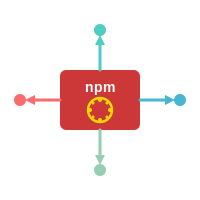

<p align="center">
  
</p>
<hr />

# Always Up To Date

[](https://github.com/pixel-perfect-software/always-up-to-date/actions/workflows/ci.yml)
[](https://github.com/pixel-perfect-software/always-up-to-date/actions/workflows/security.yml)
[](https://opensource.org/licenses/MIT)

A smart CLI tool that automatically keeps your dependencies up to date with intelligent package manager detection and workspace support.

## ✨ Features

- 📦 **Universal Package Manager Support** - Automatically detects and works with npm, yarn, pnpm, and bun
- 🔍 **Dependency Checking** - Check for outdated packages across your project
- 🚀 **Smart Updates** - Update packages while respecting workspace configurations
- 🏢 **Workspace Support** - Full support for npm workspaces and monorepo structures
- 🎯 **Intelligent Detection** - Automatically detects your package manager from lock files
- 🛠️ **Extensible Architecture** - Modular design with dedicated managers, migrators, and PR generators

## 🏗️ Architecture

The tool is built with a modular architecture:

- **Managers** - Package manager specific implementations (npm, yarn, pnpm, bun)
- **Migrators** - Smart migration rules for popular packages (React, Next.js, etc.)
- **PR Generators** - Automated pull request creation with detailed migration guides
- **Command Runner** - Unified command execution across all package managers

## 🔜 Coming Soon

- Enhanced migration rules for popular frameworks
- GitHub integration with automated PR creation
- Advanced configuration options
- Security vulnerability scanning
- Interactive update selection

## 🚀 Quick Start

```bash
# Global installation (recommended)
npm install -g @pixel-perfect-software/always-up-to-date

# Initialize the library
autd init

# Check for outdated dependencies
autd check

# Update outdated dependencies
autd update

# Migrate packages with breaking changes (coming soon)
autd migrate
```

## 🔧 Basic Usage Examples

```bash
# Check for outdated dependencies
autd check

# Update all outdated dependencies
autd update

# Get help and see all available commands
autd help
```

## 📦 Package Manager Detection

The tool automatically detects your package manager by looking for lock files:

- **npm** - `package-lock.json`
- **yarn** - `yarn.lock`
- **pnpm** - `pnpm-lock.yaml`
- **bun** - `bun.lock`

## 🏢 Workspace Support

Full support for workspaces and monorepos:

- **npm workspaces** - Automatically detected from `package.json` workspaces field
- **yarn workspaces** - Automatically detected from `package.json` workspaces field
- **pnpm workspaces** - Automatically detected from `pnpm-workspace.yaml`
- **bun workspaces** - Automatically detected from `package.json` workspaces field

## 🛠️ Available Commands

- `check` - Check for outdated dependencies in your project
- `update` - Update all outdated dependencies
- `migrate` - Migrate packages with breaking changes (coming soon)
- `help` - Display help information

## ⚙️ Current Implementation

The current implementation provides:

- ✅ Package manager auto-detection
- ✅ Dependency version checking
- ✅ Package updating with workspace support
- ✅ Modular architecture for extensibility
- 🚧 Migration system (in development)
- 🚧 PR generation (in development)
- 🚧 Advanced configuration (planned)

## 🤝 Contributing

Contributions are welcome! Please see our [Contributing Guide](./docs/contributing.md) for details on how to get started.

## 💸 Support this package's development & maintenance

<a href="https://www.buymeacoffee.com/tylernrobertson" target="_blank">

## 📝 License

MIT © [Tyler Robertson](https://github.com/TylerNRobertson) - See [LICENSE](LICENSE) for details.
