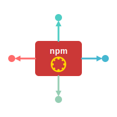

<p align="center">
  
</p>
<hr />

# Always Up To Date

[](https://github.com/pixel-perfect-software/always-up-to-date/actions/workflows/ci.yml)
[](https://github.com/pixel-perfect-software/always-up-to-date/actions/workflows/security.yml)
[](https://opensource.org/licenses/MIT)

A smart CLI tool that automatically keeps your dependencies up to date with intelligent package manager detection and workspace support.

## ✨ Features

- 📦 **Universal Package Manager Support** - Automatically detects and works with npm, yarn, pnpm, and bun
- 🔍 **Dependency Checking** - Check for outdated packages across your project
- 🚀 **Smart Updates** - Update packages while respecting workspace configurations
- 🏢 **Workspace Support** - Full support for npm workspaces and monorepo structures
- 🎯 **Intelligent Detection** - Automatically detects your package manager from lock files
- 🛠️ **Extensible Architecture** - Modular design with dedicated managers, migrators, and PR generators

## 🏗️ Architecture

The tool is built with a modular architecture:

- **Managers** - Package manager specific implementations (npm, yarn, pnpm, bun)
- **Migrators** - Smart migration rules for popular packages (React, Next.js, etc.) (Coming Soon!)
- **PR Generators** - Automated pull request creation with detailed migration guides (Coming Soon!)
- **Command Runner** - Unified command execution across all package managers

## 🔜 Coming Soon

- Migration rules for popular frameworks (React, Next.js, etc.)
- GitHub integration with automated PR creation
- Security vulnerability scanning

## 📋 Requirements

- **Node.js** 24 or higher
- One of: **npm**, **yarn**, **pnpm** (10+), or **bun**

## 🚀 Quick Start

```bash
# Global installation (recommended)
npm install -g @pixel-perfect-software/always-up-to-date

# Initialize the library
autd init

# Check for outdated dependencies
autd check

# Update outdated dependencies
autd update
```

## 🔧 Usage Examples

```bash
# Check for outdated dependencies
autd check

# Check with JSON output (useful for CI/CD pipelines)
autd check --json

# Update all eligible dependencies
autd update

# Update specific packages only
autd update react lodash @babel/core

# Preview what would be updated without making changes
autd update --dry-run

# Interactively select which packages to update
autd update --interactive

# Combine flags: dry-run specific packages with JSON output
autd update react --dry-run --json

# Get help and see all available commands
autd help
```

## 📦 Package Manager Detection

The tool automatically detects your package manager by looking for lock files:

- **npm** - `package-lock.json`
- **yarn** - `yarn.lock`
- **pnpm** - `pnpm-lock.yaml`
- **bun** - `bun.lock`

## 🏢 Workspace Support

Full support for workspaces and monorepos:

- **npm workspaces** - Automatically detected from `package.json` workspaces field
- **yarn workspaces** - Automatically detected from `package.json` workspaces field
- **pnpm workspaces** - Automatically detected from `pnpm-workspace.yaml`
- **bun workspaces** - Automatically detected from `package.json` workspaces field

## 🛠️ Available Commands

| Command | Description |
|---------|-------------|
| `autd init` | Initialize configuration in the current directory |
| `autd check` | Check for outdated dependencies in your project |
| `autd check --json` | Output outdated packages as JSON |
| `autd update` | Update all eligible dependencies |
| `autd update [packages...]` | Update only the specified packages |
| `autd update --dry-run` | Preview which packages would be updated |
| `autd update -i, --interactive` | Interactively select packages to update |
| `autd update --json` | Output update results as JSON |
| `autd help` | Display help information |

## ⚙️ Configuration

Run `autd init` to create a `.always-up-to-date.json` file in your project root:

```json
{
  "allowMinorUpdates": false,
  "allowMajorUpdates": false,
  "updateAllowlist": [],
  "updateDenylist": [],
  "debug": false,
  "silent": false
}
```

| Option | Default | Description |
|--------|---------|-------------|
| `allowMinorUpdates` | `false` | Allow minor version updates (e.g., 1.0.0 → 1.1.0) |
| `allowMajorUpdates` | `false` | Allow major version updates (e.g., 1.0.0 → 2.0.0). Implies `allowMinorUpdates`. |
| `updateAllowlist` | `[]` | Packages that are always updated regardless of version type |
| `updateDenylist` | `[]` | Packages that are never updated |
| `debug` | `false` | Enable debug logging |
| `silent` | `false` | Suppress all output |

Patch updates (e.g., 1.0.0 → 1.0.1) are always allowed unless a package is on the deny list.

## 🤝 Contributing

Contributions are welcome! Please see our [Contributing Guide](./docs/contributing.md) for details on how to get started.

## 💸 Support this package's development & maintenance

<a href="https://www.buymeacoffee.com/tylernrobertson" target="_blank">

## 📝 License

MIT © [Tyler Robertson](https://github.com/TylerNRobertson) @ [Pixel Perfect Software Inc.](https://github.com/pixel-perfect-software) - See [LICENSE](LICENSE) for details.
